# AniLibrix Plus

[](https://github.com/anilibria/alice/LICENSE)
[](https://github.com/AnimeHaze/anilibrix-plus/issues)

<div>
    <a href="https://anilibria.tv/">
        
    </a>
</div>

Десктопный аниме-кинотеатр Анилибрии для любого вашего компьютера.


[](https://t.me/anilibrix_plus) [](https://t.me/anilibrix_plus_chat)

[](https://snapcraft.io/anilibrix-plus)


### Сравнение возможностей: Anilibria (официальный) vs Anilibrix Plus
| Особенность / Функция | AnilibriX (официальный) | AnilibriX Plus (неофициальный форк) |
| :--- | :--- | :--- |
| **Авторизация** | Только стандартная (логин/пароль) | ✅ **Вход через ВКонтакте** <br> <details><summary>Скриншот</summary>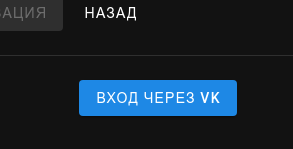</details> |
| **Управление плеером** | Нет пропуска опенинга / эндинга | ✅ **Авто-пропуск опенинга** <br>✅ **Ручной пропуск в один клик** <br>✅ **Ручной пропуск горячей клавишей** <details><summary>Скриншоты</summary>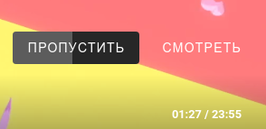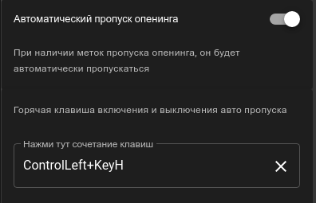</details> |
| **Синхронизация** | История хранится локально и не синхронизируется | ✅ **Резервное копирование и восстановление** данных просмотра (привязка к аккаунту) через сторонний сервер <br> <details><summary>Скриншот</summary>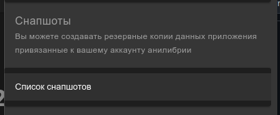</details> |
| **Случайный релиз** | Нет случайного релиза | ✅ **Кнопка случайного релиза** <br> <details><summary>Скриншот</summary>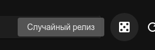</details> |
| **Интеграции** | Нет | ✅ **Discord Rich Presence** (отображение статуса просмотра) <br>  Показывает иконку приложения, постер и информацию о просматриваемом релизе: номер текущей серии, общее количество серий, название, ссылка на релиз, ссылка на сайт Anilibria, сколько осталось времени до конца серии <br> <details><summary>Скриншот</summary>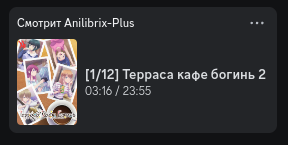</details>  |
| **Сеть и доступ** | Один сервер | ✅ **Смена API и сервера статики** (кастомный эндпоинт, выбор из списка, ручной ввод) <br> <details><summary>Скриншот</summary>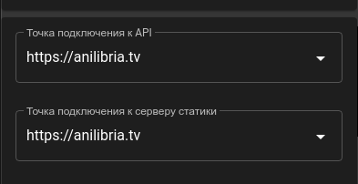</details> ✅ **Усиленный резистенс к блокирвокам**  <br> ✅ **Агрессивный локальный кеш**  <br> ✅ **Работа при частичном отсутствии сети**  <br> ✅ **Поддержка прокси** (флаг `--proxy-server=http://127.0.0.1:8008` и опция в настройках)<br>✅ **Встроенная Opera VPN** <br> <details><summary>Скриншот OperaProxy</summary>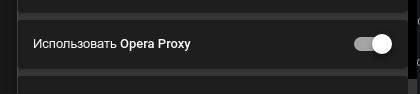</details> |
| **Интерфейс (UI/UX)** | Положение кнопок системного бара фиксировано для типа системы. <br> Кнопка вверх отсутствует | ✅ **Возможность форсировано переместить кнопки окна вправо** <br> <details><summary>Скриншот</summary>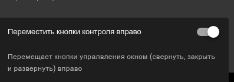</details> <br>✅ **Кнопки «НАЗАД» / «ВПЕРЕД»** <br>✅ **Кнопка «ВВЕРХ»** <br> <details><summary>Скриншот</summary>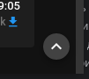</details> <br>✅ **Кнопки навигации (назад/вперед)** <br>✅ **Кнопка «Поделиться»** на странице релиза |
| **Карточка релиза** | Стандартная | ✅ **Связанные релизы (франшизы)** <details><summary>Скриншот</summary>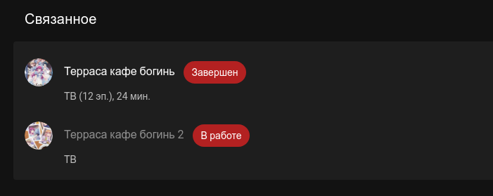</details> ✅ **Вывод дат выхода эпизодов и их названий** <details><summary>Скриншот</summary>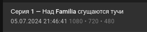</details> ✅ **Список людей, работавших над релизом (команда)** <details><summary>Скриншот</summary>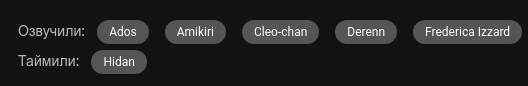</details> ✅ **Убран круглый постер** в пользу полного  <details><summary>Скриншот</summary>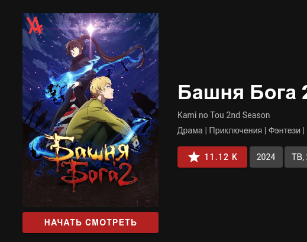</details> |
| **Избранное** | Стандартный список | ✅ **Сортировка по популярности** <br> <details><summary>Скриншот</summary>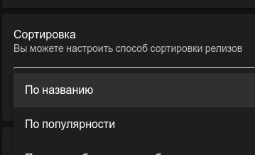</details> <br>✅ **Отображение статуса релиза** в карточке <br> <details><summary>Скриншот</summary>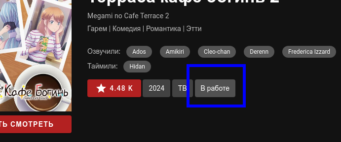</details> <br>✅ **Постоянный вывод прогресса с дискриминацией по цвету** <br> <details><summary>Скриншот</summary></details> <br>✅ **Фильтр уведомлений** (только по избранному) <br> <details><summary>Скриншот</summary>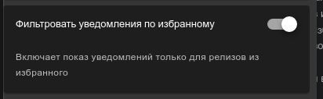</details> <br>✅ **Вывод количества у пользователей в избранном** (рейтинг) <br> <details><summary>Скриншоты</summary>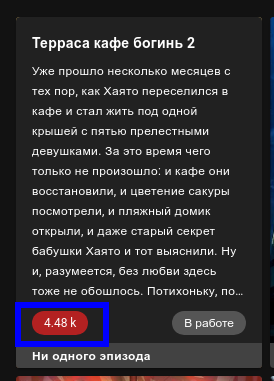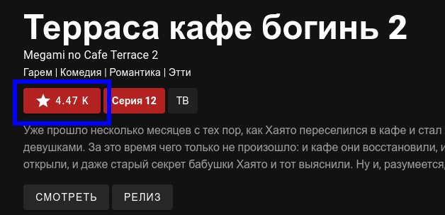</details> <br>✅ **Фильтр по статусам** ("все статусы", "все кроме в работе") <br>✅ **Вывод количества серий в сезоне** (если известно) <br>✅ **Контекстное меню для быстрой отметки просмотра серий из захода в релиз** |
| **Торренты** | Нет списка, воспроизведение торрентов сломано | ✅ **Вывод списка торрентов** с возможностью открыть во внешнем клиенте,скачать файл и скопировать magnet <br> <details><summary>Скриншот</summary>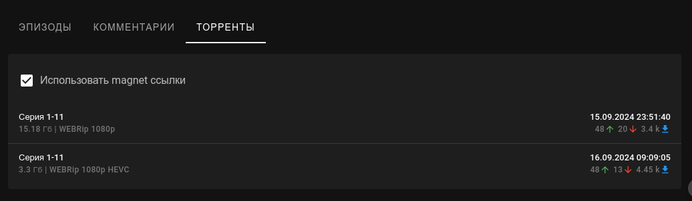</details> |
| **Системное** | Стандартное | ✅ **Показ файла конфига** в настройках (в нем хранится вся история и прогресс) <br> <details><summary>Скриншот</summary>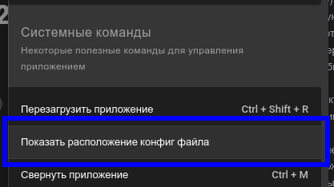</details> <br>✅ **Кеш постеров и статики** <br>✅ **Сохранение состояния окна** (положение, фуллскрин) <br>✅ Прогресс и данные **не удаляются при деинсталляции** |
| **Платформы** | Windows, Linux, macOS (x64) | ✅ **Наличие Flatpak / RPM / DEB пакетов** <br> ✅ **Версия для ARM (macOS)** — без Rosetta 2 <br>✅ Linux-пакет с категорией `AudioVideo;Video;Player;` |
| **Поддержка контента** | Только видео с серверов Anilibria | ✅ **Поддержка Anilibria Rutube-релизов** в плеере (пометка RUTUBE в сериях) |
| **Исправления и улучшения** | - | ✅ Исправлен баг с прогрессом (у релизов, где серии начинаются не с 1)<br>✅ Фикс засыпания компьютера и выключения экрана при просмотре<br>✅ Исправлен баг с автовоспроизведением (0 эпизод)<br>✅ Меньше вылетов из аккаунта (повторная авторизация автоматически)<br>✅ Регулировка громкости (20 делений вместо 10)<br>✅ Фикс запуска при поврежденном конфиге (ранее в таком случае оно переставало запускаться)<br>✅ Исправлено пропадание из избранного релизов-анонсов<br>✅ Picture-in-picture теперь не сбрасывается при переключении серий |


#### Анилибрия — так звучит аниме!

### Горячие клавиши плеера

| Клавиша | Действие                               |
|---------|----------------------------------------|
| F       | Переключение полноэкранного режима     |
| ←       | Назад                                  |
| →       | Вперед                                 |
| ↑       | Громкость больше (или колесиком мышки) |
| ↓       | Громкость меньше (или колесиком мышки) |
| space   | Воспроизведение / пауза                |

Плюс кастомные клавиши на свое усмотрение которые устанавливаются в настроках для:
- Включения выключени автопропуска опенинга не выходя из плеера
- Пропуска опенинга

---

### Сборка и запуск

<details>
<summary>🔧 Инструкция для разработчиков (нажмите для раскрытия)</summary>

> **Требуемая версия Node.JS - 14.x.x**  
> На других версиях (особенно выше) могут быть проблемы со сборкой нативных модулей  
>  
> *Чертов сраный легаси проще переписать с нуля...*

Перед запуском не забудьте скопировать и отредактировать пример `.env` файла:

```bash
cp .env.example .env
```

```bash
# Установка и сборка зависимостей
yarn install

# Запуск с горячей перезагрузкой на localhost:9080
yarn run serve

# Сборка production версии
yarn run build

# Запуск ESLint --fix для JS/Vue файлов и компонентов в `src/`
yarn run lint:fix

# Сборка под все платформы
yarn run release

# Сборка под MacOS
yarn run release:mac

# Сборка под Windows
yarn run release:win

# Сборка под Linux
yarn run release:lin
```

</details>
